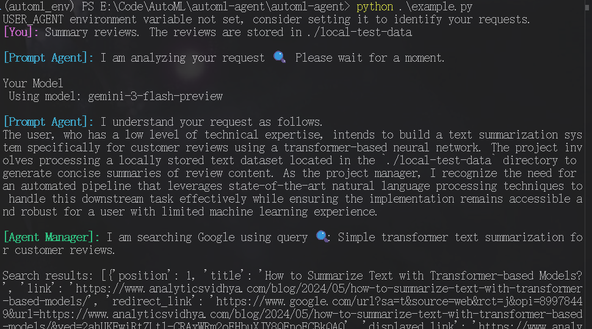
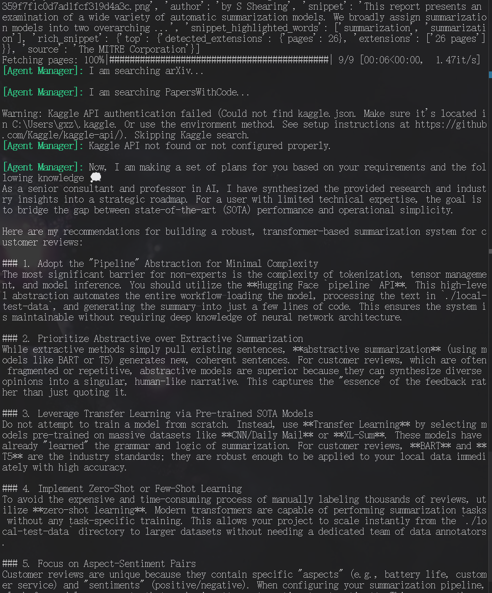
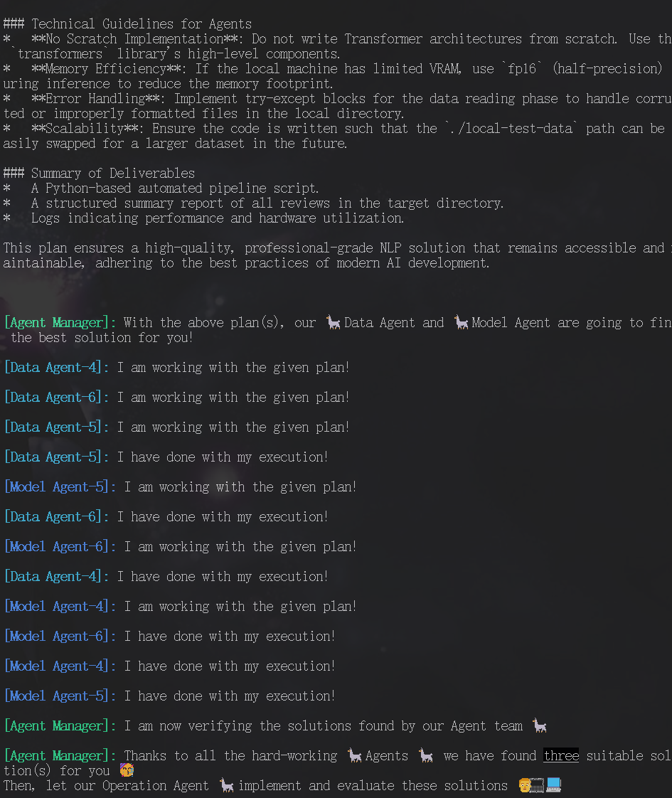

本项目来源于 https://github.com/DeepAuto-AI/automl-agent

使用须知：

安装
1. 将configs.py里面的"key待填"填上相应的api key
2. 将utils/__init__.py里面的"key待填"填上相应的serpapi key，可以在 https://serpapi.com/ 注册获得
3. 从 https://github.com/World-Snapshot/papers-with-code/tree/main/data 下载datasets.json和evaluation-tables.json到当前目录下的_data\paperswithcode目录下
4. 依赖直接使用environment.yaml安装环境

其他
1. 建议在linux环境下使用，windows可能在执行生成的程序时会发生错误(不过前面的步骤没问题)
2. kaggle可选安装，如果想使用请看官网
3. 记得挂梯运行程序，程序有多处需要访问外网网站
4. 如果成功，会在agent_workspace/exp下生成程序
5.  项目中的本地模型全部替换为外部模型
6. 项目中一个调用的搜索网站papers with code已倒闭，可能程序执行效果有所下降
7. `Connection error`网络波动实属正常，可以多试几次
8. 可以执行`python example.py`完成简单的初步测试

执行截图：

